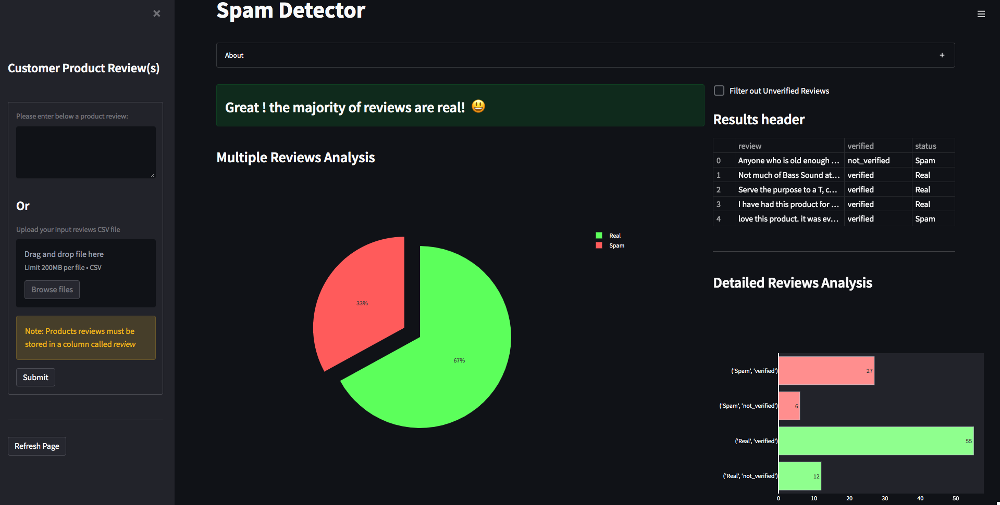
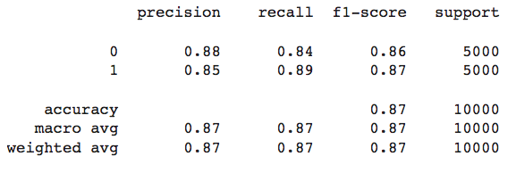
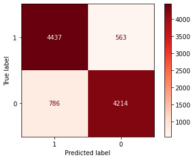
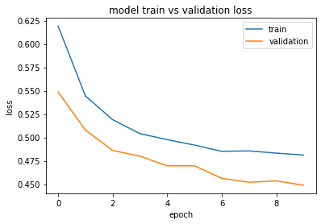
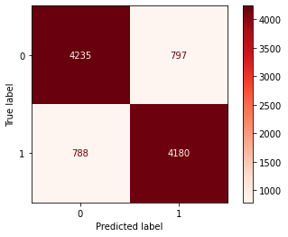

<!-- Add banner here -->

# Customer Reviews Spam Classifier
This is a web application that classify single/many input customer reviews for being either fake(spam) or real(non-spam), with an extra functionality to filter out `unverified` customers' reviews.  
The application can be accessed [**here**](https://spamclassifier11.herokuapp.com/).
# Demo-Preview

# Table of contents
- [Project Title](#customer-reviews-spam-classifier)
- [Demo-Preview](#demo-preview)
- [Usage](#usage)
- [Development](#development)
- [Contribute](#contribute)
# Usage
This [**Spam Detector**](https://spamclassifier11.herokuapp.com/) application expects the files containing multiple customer reviews to be `CSV` files with the reviews texts stored in a column named `'review'`.  
> **_NOTE:_**  For Demo purpose, the app. provides a sample dataset of 100 Amazon products(PCs) review's from [**TensorFlow Datasets**](https://www.tensorflow.org/datasets/catalog/amazon_us_reviews#amazon_us_reviewspc_v1_00).
# Development
- ### Model Development
  - #### Data Collection
  I used a dataset of Amazon electronic products reviews with spam and non-spam labels from Kaggle Datasets, labeled and shared by [(Hussain et al., 2020)](https://ieeexplore.ieee.org/document/9027828)
  - #### Data Pre-processing
  I firstly reduced the dataset to 50,000 balanced reviews, and used **WordCloud** to compare the most frequent words in each category.  Then, I, realized that words like `great` and `good` are more frequent in spam reviews compared to non-spam ones.  
  Thereafter, using the `NLTK` package, I normalized each review by removing non-alphabetic words/characters, english stop-words, and lemmatization.
  - #### Feature Extraction
  I tokenized each review, and used the `Word2vec` model to get embeddings, as well as the `TfidfVectorizer`.
  - #### Benchmarking
    - I first created a 128 units `LSTM` model, and trained it with embeddings vectors generated by the `Word2vec` model.  
      Using `40%` of the dataset for `training`, `20%` for cross-validation, and `20%` for testing, I fit the model with 3 epochs, 
      resulting in an `86.51%` accuracy score. 
         
      **Confusion Matrix**  
      
    -  Secondly, I fitted a `BERT` model using the same data splits used above, and 10 epochs. The model tended to under-fit, with a resulting accuracy score of `79.78%`, and a lot more False Positives and False Negatives than the LSTM model.  
      
    -  Thenceforth, I used classical ML models with features generated by the `TfidfVectorizer`, starting with Logistic Regression. 
       Using `80%` of the dataset for training and `20%` for testing, I fit a multinomial Logistic Regression model and Cross-validated it with L2 regularization.
       The accuracy score of the the Logistic Regression model was `84.15%`, with `84%` accuracy for both precision, and recall. 
       **Confusion Matrix**  
      
    - Finally, I fit a Random Forest Classifier, resulting in a `81.54%` accuracy score, with a lot more more False Negatives compared to the previous models
> **_NOTE:_** Lastly, I exported the model with the best performance(the **LSTM** model), and deployed it with a Django API that I developed [here]().
- ### Application Development and Model Deployment
  - #### Front End
    - I used the [streamlit](https://streamlit.io/) framework for its simplicity in developing data apps.
  - #### Back End
    - I deployed the pre-trained model with a Django API that I developed, and hosted on an **AWS** EC2 instance.

# Contribute
For any suggestion or feedback, please feel free to reach out to me via [email](mailto:njucesar@gmail.com).
# License
[(Back to top)](#customer-reviews-spam-classifier)

All the code is open source, feel free to integrate it in your projects!

[GNU General Public License version 3](https://opensource.org/licenses/GPL-3.0)
